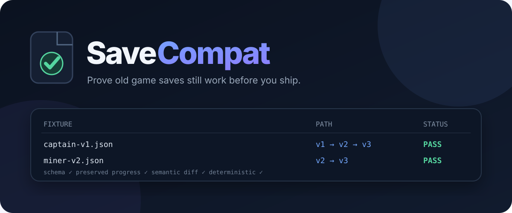

<p align="center">
  
</p>

<p align="center">
  <a href="https://github.com/KanadeK/savecompat/actions/workflows/ci.yml"></a>
  <a href="https://github.com/KanadeK/savecompat/releases"></a>
  <a href="LICENSE"></a>
  
</p>

<p align="center">
  <strong>Engine-agnostic compatibility CI for structured game saves.</strong><br>
  <a href="README.zh-CN.md">简体中文</a> ·
  <a href="https://kanadek.github.io/savecompat/">Live example report</a> ·
  <a href="examples/space-trader">Example corpus</a>
</p>

Game updates should not erase a player's campaign. SaveCompat turns old JSON saves into a test
corpus, migrates each one through every declared version, validates every step with JSON Schema,
checks that important progress survived, and emits a reviewable semantic diff plus a self-contained
HTML report.

It is a real CLI and TypeScript library—not a save editor UI, backup utility, or engine-specific
plugin.

## Why SaveCompat?

A normal unit test proves that one hand-written object migrates. SaveCompat answers the release
question:

> Can every save format we have shipped reach the new format without becoming invalid or losing
> player progress?

- **Corpus testing:** run real, anonymized saves from every released version.
- **Stepwise validation:** validate the original file and every intermediate migration result.
- **Declarative migrations:** review JSON operations without executing downloaded code.
- **Preservation rules:** prove IDs, XP, world seeds, unlocks, or other critical values survived.
- **Game-aware diffs:** match inventory/entity arrays by stable IDs instead of noisy positions.
- **Safe writes:** previews by default; explicit output; timestamped backup for in-place migration.
- **CI output:** stable exit codes, JSON results, and a single-file HTML report.

## One-minute demo

Requirements: Node.js 20 or newer.

```bash
git clone https://github.com/KanadeK/savecompat.git
cd savecompat
npm ci
npm run build

node dist/cli.js doctor --config examples/space-trader/savecompat.config.json
node dist/cli.js check \
  --config examples/space-trader/savecompat.config.json \
  --report site/index.html
```

Expected result:

```text
PASS saves/captain-v1.json v1→3
PASS saves/current-v3.json v3→3
PASS saves/miner-v2.json v2→3
PASS saves/rogue-v1.json v1→3
PASS 4/4 fixtures · 3 migrated
```

To start a tiny passing project of your own:

```bash
node dist/cli.js init ./save-compat
node dist/cli.js doctor --config ./save-compat/savecompat.config.json
node dist/cli.js check --config ./save-compat/savecompat.config.json
```

After v0.1.0 is released, the packaged CLI can be installed directly from the release artifact:

```bash
npm install --save-dev \
  https://github.com/KanadeK/savecompat/releases/download/v0.1.0/savecompat-0.1.0.tgz
npx savecompat init ./save-compat
```

## Configuration

`savecompat.config.json` connects shipped versions, schemas, migrations, fixtures, and preservation
rules:

```json
{
  "$schema": "./node_modules/savecompat/schema/savecompat.config.schema.json",
  "latestVersion": "3",
  "versionPath": "/saveVersion",
  "fixtures": ["test/saves/**/*.json"],
  "schemas": {
    "1": "save-schemas/v1.schema.json",
    "2": "save-schemas/v2.schema.json",
    "3": "save-schemas/v3.schema.json"
  },
  "migrations": [
    { "from": "1", "to": "2", "file": "save-migrations/1-to-2.json" },
    { "from": "2", "to": "3", "file": "save-migrations/2-to-3.json" }
  ],
  "preserve": [
    {
      "label": "Player identity",
      "fromVersion": ["1", "2", "3"],
      "from": "/player/id",
      "to": "/player/id"
    },
    {
      "label": "Legacy XP",
      "fromVersion": "1",
      "from": "/player/xp",
      "to": "/progression/experience"
    }
  ],
  "arrayKeys": {
    "/inventory": "id"
  }
}
```

All paths are RFC 6901 JSON Pointers. File paths and fixture globs are resolved relative to the
config file, not the shell's current directory.

## Migration DSL

A migration is deterministic JSON:

```json
{
  "description": "Move progression and normalize old inventory stacks.",
  "operations": [
    { "op": "rename", "from": "/player/xp", "path": "/progress/xp" },
    {
      "op": "map-items",
      "path": "/inventory",
      "operations": [
        { "op": "coerce", "path": "/qty", "to": "integer" },
        { "op": "clamp", "path": "/qty", "min": 0 },
        { "op": "rename", "from": "/qty", "path": "/quantity" }
      ]
    },
    {
      "op": "set-default",
      "path": "/settings",
      "value": { "difficulty": "normal", "autosave": true }
    }
  ]
}
```

| Operation      | Purpose                                                  |
| -------------- | -------------------------------------------------------- |
| `set-default`  | Add a value only when the path is absent                 |
| `set`          | Set or replace a value                                   |
| `rename`       | Move a value, with explicit conflict policy              |
| `copy`         | Copy a value, with explicit conflict policy              |
| `delete`       | Remove an obsolete value                                 |
| `coerce`       | Safely coerce string, number, integer, or boolean values |
| `clamp`        | Bound a finite numeric value                             |
| `map-enum`     | Translate old enum labels                                |
| `ensure-array` | Create, wrap, or normalize an array                      |
| `map-items`    | Apply nested operations to every item in an array        |

See [Migration DSL](docs/MIGRATION_DSL.md) for exact behavior and failure semantics.

## Commands

```text
savecompat doctor                         validate the project wiring
savecompat check [patterns...]            check the old-save corpus
savecompat migrate <file>                 preview one migration
savecompat migrate <file> --out <file>    write a new migrated file
savecompat migrate <file> --in-place      back up, then replace the original
savecompat migrate <file> --stdout        emit migrated JSON only
savecompat diff <before> <after>           semantic save diff
savecompat init [directory]                scaffold a passing v1→v2 example
```

Useful machine outputs:

```bash
savecompat check --json > savecompat-report.json
savecompat check --report savecompat-report.html
savecompat diff old.json new.json --json
```

`check` exits with code `1` if a fixture fails or no fixture matches. `migrate` never writes unless
`--out` or `--in-place` is supplied.

## GitHub Actions

```yaml
name: Save compatibility
on: [push, pull_request]

jobs:
  old-saves:
    runs-on: ubuntu-latest
    steps:
      - uses: actions/checkout@v4
      - uses: actions/setup-node@v4
        with:
          node-version: 22
          cache: npm
      - run: npm ci
      - run: npx savecompat doctor
      - run: npx savecompat check --report savecompat-report.html
      - uses: actions/upload-artifact@v4
        if: always()
        with:
          name: savecompat-report
          path: savecompat-report.html
```

The repository's own CI tests Node 20, 22, and 24 and runs formatting, linting, type checks, 39
tests, a production build, and CLI smoke tests.

## TypeScript API

```ts
import { checkFixtures, loadConfig, migrateSave } from "savecompat";

const config = await loadConfig("savecompat.config.json");
const report = await checkFixtures(config);

const result = await migrateSave({ saveVersion: "1", player: { id: "p1", xp: 40 } }, config);
```

Public types include `MigrationOperation`, `SaveCompatConfig`, `MigrationResult`, `CheckReport`, and
`DiffChange`.

## Safety and scope

- SaveCompat currently targets structured JSON saves. It does not decrypt, decompress, or reverse
  engineer proprietary binary formats.
- It validates local files only and performs no telemetry or network requests.
- Migration documents are data, not executable JavaScript.
- In-place writes first create a timestamped `.bak`, then replace through an atomic same-directory
  rename.
- Real player saves should be anonymized before committing them as fixtures.

Read [Security](SECURITY.md) before using production save data.

## Project docs

- [Architecture](docs/ARCHITECTURE.md)
- [Migration DSL](docs/MIGRATION_DSL.md)
- [Troubleshooting and repair loop](docs/TROUBLESHOOTING.md)
- [Opportunity research](docs/RESEARCH.md)
- [Release checklist](docs/RELEASE_CHECKLIST.md)
- [Roadmap](ROADMAP.md)
- [Contributing](CONTRIBUTING.md)

## Development

```bash
npm ci
npm run check
npm run test:coverage
npm run release:check
```

The definitive acceptance command is `npm run release:check`. If it fails, follow the
[failure-to-fix table](docs/TROUBLESHOOTING.md#release-check-failures), rerun the smallest failing
command, then rerun the full acceptance command.

## License

[MIT](LICENSE) © Vesper
