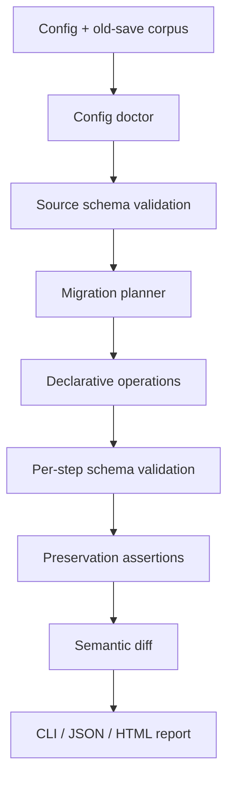

# Architecture

SaveCompat is split into a small deterministic core and thin I/O adapters. The core accepts JSON
values and returns typed results, so it can be tested without shell processes or game engines.

## Module boundaries

| Module                | Responsibility                                                                                               |
| --------------------- | ------------------------------------------------------------------------------------------------------------ |
| `config.ts`           | Parse paths relative to the config, discover fixtures, load migration documents, inspect the migration graph |
| `json-pointer.ts`     | Safe RFC 6901 reads and mutations with prototype-pollution guards                                            |
| `operations.ts`       | Deterministic implementation of the migration DSL                                                            |
| `schema-validator.ts` | Compile and cache per-version JSON Schema validators                                                         |
| `migrate.ts`          | Plan a version path, validate each step, run preservation rules, and return a typed result                   |
| `diff.ts`             | Produce stable semantic changes, including ID-keyed entity arrays                                            |
| `check.ts`            | Apply the migration pipeline to a corpus and aggregate a report                                              |
| `file-output.ts`      | Non-overwriting output and backup-first atomic in-place replacement                                          |
| `report.ts`           | Render an escaped, self-contained HTML report                                                                |
| `cli.ts`              | Map commands and exit codes onto the core API                                                                |

## Data flow and invariants

1. Read and validate the source version before changing data.
2. Resolve exactly one outgoing migration per historical version.
3. Clone the input; the caller's object is never mutated.
4. Apply a migration document in listed order.
5. Update the version field only after all operations in that step finish.
6. Validate against that step's target schema.
7. Stop immediately on a failed operation or schema.
8. Compare configured source and target paths from the untouched original and final clone.
9. Generate a semantic diff even for failed migrations so the partial result remains diagnosable.
10. Write nothing unless the caller explicitly asks for output.

## Determinism

Migration operations do not read clocks, randomness, networks, environment variables, or arbitrary
code. Given the same config and input bytes, the migrated JSON value and semantic changes are stable.
Runtime duration and report generation time are metadata and are not written into saves.

## Trust boundary

Config, schema, migration, and fixture files are untrusted local inputs. JSON Pointer segments reject
`__proto__`, `prototype`, and `constructor`. HTML output escapes file names, diagnostics, paths, and
metadata. JSON Schemas are compiled locally with Ajv; remote references are not fetched.

See [Security](../SECURITY.md) for data-handling guidance.
